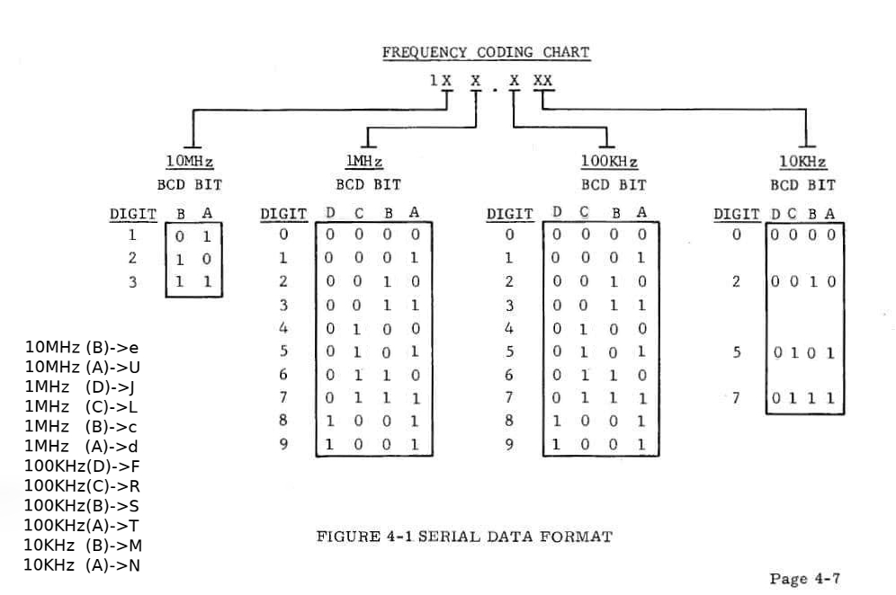

# VHF Communications Transceiver Control System

## Introduction

This project implements a control system for a VHF (Very High Frequency) Communications Transceiver, utilizing an Arduino board to interface with a 4x4 keypad and a 7-segment LED display. The system is designed to facilitate two-way communications within the 116.000MHz to 135.000MHz frequency range, with adjustments in 25KHz increments. It translates decimal frequency inputs into BCD (Binary-Coded Decimal) bit code for easy transmission and accurate signal processing.

## System Features

- **Frequency Range:** 116.000MHz to 135.000MHz, adjustable in 25KHz increments.
- **Input Method:** 4x4 keypad for frequency entry.
- **Display:** 7-segment LED to show the current frequency.
- **Output Encoding:** Converts decimal frequency inputs into BCD bit code.

## Implementation Details

The system utilizes an Arduino board to control the 7-segment display and read inputs from the keypad. Key functions include displaying a welcome message, converting keypad inputs into BCD format, and updating the display to reflect the current frequency setting.

### Key Components

- **Arduino Board:** Serves as the central control unit.
- **4x4 Keypad:** Allows for user input of frequencies.
- **7-Segment LED Display:** Shows the entered frequency and operational status messages.
- **LedControl Library:** Manages communication with the LED display driver.
- **Keypad Library:** Facilitates reading inputs from the keypad.

### Setup

1. Connect the 4x4 keypad to the Arduino according to the pin configuration specified in the code.
2. Connect the 7-segment display to the Arduino, ensuring correct alignment with the output pins.
3. Upload the provided Arduino sketch to the board.

### Usage

- Upon powering on, the display shows a "Hello" message followed by a sequence of numbers to indicate readiness.
- Enter the desired frequency using the keypad. The display updates in real-time to show the current input.
- Use the `*` key to clear the current input, and the `#` key to finalize the frequency setting.

## Code Overview

### Key Functions

- **`setup()`:** Initializes the display and keypad, sets the display brightness, and clears any previous output.
- **`hello()`:** Displays a welcome message and a sequence of numbers.
- **`power(base, exponent)`:** Calculates the power of a given number, used in various calculations within the code.
- **`digitToBcd(digit)`:** Converts a decimal digit to its BCD representation.
- **`loop()`:** Main program loop, handles keypad inputs and updates the display accordingly.

## Connectivity Diagram

## Wiring Guide

- **Speaker:** Connect to C & D wires.
- **PTT (Push to Talk):** Connect to Z & Ground.
- **Squelch Test:** Connect to A & Ground.
- **Mic Audio:** Connect to X.

## Author

This system was developed and implemented by Paschalis Moschogiannis, a passionate developer in the field of communication technology. With a focus on enhancing VHF transceiver usability and accuracy, this project reflects a commitment to improving communication systems.

For inquiries or potential collaborations, please contact pmoschogiannis@uth.gr.

## To Do

- [x] **Implement a default Version on ATmega2560 without Shift Registers:**

- [ ] **Implement a New Version on ATmega328P with Shift Registers:** Transition from using the Arduino Mega (ATmega2560) to a more compact ATmega328P, incorporating shift registers to manage I/O pins more efficiently.

- [ ] **Dual 7-Segment Display for Active and Standby Frequencies:** Develop a version that includes two 7-segment displays, one showing the active frequency and the other the standby frequency. Implement a button to switch frequencies between active and standby, enhancing operational flexibility.

- [ ] **Rotary Encoder for Frequency Selection:** Introduce a version where frequency selection is controlled through a rotary encoder instead of a keypad. This version will also include an additional 7-segment display to show the selected frequency, providing a more intuitive user interface for frequency adjustment.

## Conclusion

This VHF control system simplifies the process of setting frequencies on a VHF transceiver, enhancing communication efficiency and accuracy. By converting decimal inputs into BCD code, it provides a user-friendly interface for complex communication operations. The outlined future enhancements aim to further improve usability and functionality, ensuring the system remains at the forefront of communication technology advancements.

## License

This project is licensed under the [GNU General Public License Version 3 (GPLv3)](LICENSE).
